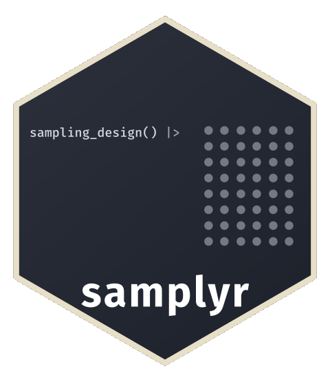

<!-- README.md is generated from README.Rmd. Please edit that file -->

```{r, include = FALSE}
knitr::opts_chunk$set(
  collapse = TRUE,
  comment = "#>",
  fig.path = "man/figures/README-",
  out.width = "100%"
)
```

# samplyr 

<!-- badges: start -->
[](https://CRAN.R-project.org/package=samplyr)
[](https://gitlab.com/dickoa/samplyr/-/pipelines)
[](https://app.codecov.io/gl/dickoa/samplyr?branch=main)
<!-- badges: end -->

A tidy grammar for survey sampling in R. `samplyr` provides a minimal set of composable verbs for stratified, clustered, multi-stage, and multi-phase sampling designs with PPS methods, sample coordination, and panel rotation.

## Ecosystem Positioning

`samplyr` sits in the middle of a three-layer workflow:

- Use `svyplan` for planning (`n`, precision, power, allocation, budget).
- Use `samplyr` to specify designs, draw samples, and carry design metadata through fieldwork.
- Use `survey`/`srvyr` after data collection for estimation and inference.

These packages are complementary, not competing. Handoffs are explicit (for example, `svyplan` outputs can feed `draw(n = ...)`, and `samplyr` outputs convert via `as_svydesign()`, `as_svrepdesign()`, and `as_survey_design()`).

## Why samplyr?

`samplyr` is built around a simple idea: sampling code should read like its English description.

```{r overview}
library(samplyr)
data(bfa_eas)

# "Stratify by region, proportionally allocate 500 samples, execute"
sampling_design() |>
  stratify_by(region, alloc = "proportional") |>
  draw(n = 500) |>
  execute(bfa_eas, seed = 1)
```

Consider a real survey design from Lohr (2022, Example 7.1), based on a 1991 study of bed net use in rural Gambia (D'Alessandro et al., 1994):

> Malaria morbidity can be reduced by using bed nets impregnated with insecticide, but this is only effective if the bed nets are in widespread use. In 1991, a nationwide survey was designed to estimate the prevalence of bed net use in rural areas of the Gambia (D'Alessandro et al., 1994).
>
> The sampling frame consisted of all rural villages of fewer than 3,000 people. The villages were **stratified by three geographic regions** (eastern, central, and western) and by **whether the village had a public health clinic (PHC)** or not. In each region **five districts were chosen with probability proportional to the district population**. In each district **four villages were chosen, again with probability proportional to census population**: two PHC villages and two non-PHC villages. Finally, **six compounds were chosen** more or less randomly from each village.

In `samplyr`, this three-stage stratified cluster design translates directly into code:

```{r}
design <- sampling_design(title = "Gambia bed nets") |>
  add_stage() |>
    stratify_by(region) |>
    cluster_by(district) |>
    draw(n = 5, method = "pps_brewer", mos = population) |>
  add_stage() |>
    stratify_by(phc) |>
    cluster_by(village) |>
    draw(n = 2, method = "pps_brewer", mos = population) |>
  add_stage() |>
    draw(n = 6)
design
```

The `samplyr` code mirrors the verbal description verb for verb.

*Lohr, S. L. (2022). Sampling: Design and Analysis (3rd ed.). CRC Press.*

## Installation

```{r, eval = FALSE}
# Install sondage first (sampling algorithms backend)
pak::pkg_install("gitlab::dickoa/sondage")

# Install svyplan (sample size, precision, power, and stratification)
pak::pkg_install("gitlab::dickoa/svyplan")

# Install samplyr
pak::pkg_install("gitlab::dickoa/samplyr")
```

## The Grammar

`samplyr` uses 5 verbs and 1 modifier:

| Function            | Purpose                               |
|---------------------|---------------------------------------|
| `sampling_design()` | Create a new sampling design          |
| `stratify_by()`     | Define stratification and allocation  |
| `cluster_by()`      | Define cluster/PSU variable           |
| `draw()`            | Specify sample size and method        |
| `execute()`         | Run the design on a frame             |
| `add_stage()`       | Delimit stages in multi-stage designs |

### Frame-Independent Design

`stratify_by()` and `cluster_by()` take bare column names. The design is stored as a specification and resolved only when a frame is available
(`validate_frame()`, `execute()`, `as_svydesign()`), so design specification stays separate from execution.

```{r frame-independent}
design <- sampling_design() |>
  stratify_by(region, alloc = "proportional") |>
  cluster_by(ea_id) |>
  draw(n = 300)

sample <- execute(design, bfa_eas, seed = 2)
sample
```

## Quick Start

```{r quick-start}
library(samplyr)
data(bfa_eas)

# Simple random sample
srs_smpl <- sampling_design() |>
  draw(n = 100) |>
  execute(bfa_eas, seed = 321)

srs_smpl

# Stratified proportional allocation
strata_smpl <- sampling_design() |>
  stratify_by(region, alloc = "proportional") |>
  draw(n = 300) |>
  execute(bfa_eas, seed = 12)

strata_smpl

# PPS cluster sampling
cluster_smpl <- sampling_design() |>
  cluster_by(ea_id) |>
  draw(n = 50, method = "pps_brewer", mos = households) |>
  execute(bfa_eas, seed = 123)

cluster_smpl
```

## Multi-Stage Sampling

Use `add_stage()` to define multi-stage designs. This example selects districts with PPS, then samples EAs within each:

```{r multi-stage}
library(dplyr, warn.conflicts = FALSE)
data(zwe_eas)

# Add district-level measure of size
zwe_frame <- zwe_eas |>
  mutate(district_hh = sum(households), .by = district)

# Two-stage design: 10 districts, 5 EAs per district
sample <- sampling_design() |>
  add_stage(label = "Districts") |>
    cluster_by(district) |>
    draw(n = 10, method = "pps_brewer", mos = district_hh) |>
  add_stage(label = "EAs") |>
    draw(n = 5) |>
  execute(zwe_frame, seed = 12345)

sample
```

### Operational Sampling

Execute stages separately when fieldwork happens between stages:

```{r operational}
design <- sampling_design() |>
  add_stage(label = "EA") |>
    stratify_by(urban_rural) |>
    cluster_by(ea_id) |>
    draw(n = 10, method = "pps_brewer", mos = households) |>
  add_stage(label = "HH") |>
    draw(n = 5)

# Execute stage 1 only
selected_eas <- execute(design, zwe_eas, stages = 1, seed = 1)
selected_eas

# ... fieldwork ...
# list all households in selected EAs
selected_eas_list <- selected_eas |>
  slice(rep(seq_len(n()), households)) |>
  mutate(hh_id = row_number())

# Execute stage 2
final_sample <- selected_eas |>
  execute(selected_eas_list, seed = 2)
final_sample
```

`selected_eas` still contains `design` plus the realized stage-1 selection.
Using it as the first argument continues that same multi-stage design. The
expanded listing is only the candidate frame for stage 2. Starting from a new
design with a prior `tbl_sample` as its frame instead denotes a new sampling
phase.

If `tidyr::uncount()` or another operation drops the listing's `tbl_sample`
class, keep using that plain object as the second argument above. `execute()`
recognizes its inherited sampling attributes and generated columns and refuses
to run it as a fresh frame from `design`, which would silently rerun stage 1.
Passing the intact `selected_eas` back as a frame of `design` also warns: that
call is supported as a new sampling phase, but it is not stage continuation.

## Selection Methods

Sixteen methods ship in three families:

- **Equal probability**: `srswor` (the default), `srswr`, `systematic`,
  `bernoulli`
- **PPS**, all requiring a measure of size: `pps_brewer`, `pps_systematic`,
  `pps_cps`, `pps_sampford`, `pps_poisson`, `pps_sps`, `pps_pareto`,
  `pps_multinomial`, `pps_chromy`
- **Balanced**: `cube`, plus the spatial `lpm2` and `scps`

`?selection-methods` is the reference: which take `n` or `frac`, which need
`mos`, `aux` or `spread`, which have a random rather than fixed sample size,
which accept permanent random numbers, and the paper behind each. Custom
methods registered with `sondage::register_method()` are used the same way.

## Allocation Methods

When stratifying, control how the total sample is distributed:

| Method         | Description                                             |
|----------------|---------------------------------------------------------|
| (none)         | `n` applies per stratum                                 |
| `equal`        | Same sample size in each stratum                        |
| `proportional` | Proportional to stratum size                            |
| `neyman`       | Minimize variance (requires `variance`)                 |
| `optimal`      | Minimize cost-variance (requires `variance` and `cost`) |
| `power`        | Compromise allocation (requires `cv` and `importance`)  |

### Sample Size Bounds

Use `min_n` and `max_n` in `draw()` to constrain stratum sample sizes when using allocation methods:

```{r bounds}
data(bfa_eas_variance)

# Ensure at least 2 per stratum (minimum for variance estimation)
sampling_design() |>
  stratify_by(region, alloc = "neyman", variance = bfa_eas_variance) |>
  draw(n = 300, min_n = 2) |>
  execute(bfa_eas, seed = 321)
```

### Custom Allocation

For custom stratum-specific sizes or rates, pass a data frame to `n` or `frac` in `draw()`:

```{r custom-alloc, eval = FALSE}
# Custom allocation with data frame
sizes_df <- data.frame(
  region = c("North", "South", "East", "West"),
  n = c(100, 200, 150, 100)
)

sample <- sampling_design() |>
  stratify_by(region) |>
  draw(n = sizes_df) |>
  execute(frame, seed = 42)
```

```{r neyman}
# Neyman allocation
data(bfa_eas_variance)

sample <- sampling_design() |>
  stratify_by(region, alloc = "neyman", variance = bfa_eas_variance) |>
  draw(n = 300) |>
  execute(bfa_eas, seed = 4321)

sample
```

## Beyond the Basics

The verbs above cover most designs. These capabilities work the same way and
are documented where they are taught in depth:

| Capability | How | Where |
|---|---|---|
| Balanced sampling | `draw(method = "cube", aux = ...)`, with `bound()` for hard count constraints | `vignette("introduction")` |
| Spatially balanced | `draw(method = "lpm2" or "scps", spread = c(lon, lat))` | `?selection-methods` |
| Sample coordination | `draw(prn = ...)` with permanent random numbers, for overlap across waves | `vignette("sampling-coordination")` |
| Custom methods | `sondage::register_method()`, then `pps_<name>` or `balanced_<name>` | `vignette("introduction")` |
| Panel rotation | `execute(panels = 4)`, or `panel_stage =` to rotate units inside retained parents | `vignette("rotating-panels")` |
| Replicated draws | `execute(reps = 5)` | `?execute` |
| Two-phase | pipe a `tbl_sample` into a new design's `execute()` | `vignette("survey-analysis")` |
| Indirect sampling | `share_weights()`, to estimate for a population linked to the one that was sampled | `vignette("design-semantics")` |
| Overlapping frames | `stack_frames()`, for two registers of one population | `vignette("survey-analysis")` |

```{r beyond, eval = FALSE}
# Balanced on auxiliary totals, PPS on size
sampling_design() |>
  stratify_by(region, alloc = "proportional") |>
  draw(n = 300, method = "cube", mos = households,
       aux = c(population, area_km2)) |>
  execute(bfa_eas, seed = 24)

# Four rotation groups, five independent replicates
execute(design, bfa_eas, seed = 1, panels = 4)
execute(design, bfa_eas, seed = 42, reps = 5)

# Areas stay in the survey while the households inside them rotate
execute(two_stage_design, frame, seed = 1, panels = 4, panel_stage = 2)
```

## Survey Export

Convert to `survey` or `srvyr` for estimation:

```{r survey-export, eval = FALSE}
svy <- as_svydesign(sample)
survey::svymean(~y, svy)

as_survey_design(sample) |> dplyr::summarise(mean_y = srvyr::survey_mean(y))
```

`as_svydesign()` uses the Brewer variance approximation by default.
`joint_expectation()` computes exact pairwise joint inclusion probabilities
where the method supports them, for tighter variance estimates. See
`vignette("survey-analysis")` for domain estimation, replicate weights, and the
method-by-method breakdown.

Both export verbs also take a `stack_frames()` collection, compositing
overlapping frames through `survey::multiframe()` or through a combined
replicate design that varies one frame at a time.


## Diagnostics

```{r diagnostics}
summary(strata_smpl)
```

By default, each execution records a summary frame digest: a compact record of
the selection pools and chances the design resolved. `frame_summary()` returns
it as tibbles without needing the frame. Use `frame_digest = "none"` for the
lowest execution overhead, or `frame_digest = "full"` when downstream work
needs exact per-unit chances for unequal-probability element stages. The
companion package samplens, in development, draws the digest as a visual
sampling card. See `vignette("introduction")` for examples.

`execute()` also reports when the frame could not deliver what the design
asked for. A pool holding fewer units than the stage requested is selected
whole, which makes the design non-self-weighting, so this is a warning rather
than a silent adjustment. Each finding is reported once per stage, however
many pools were affected and however many replicates ran:

| Condition | Meaning |
|---|---|
| `samplyr_warning_size_capped` | Some pools held fewer units than requested |
| `samplyr_warning_census` | The stage selected every unit within reach, so it contributes no sampling variance |
| `samplyr_warning_nominal_cap` | A random-size method asked for more units than the pool holds |
| `samplyr_warning_poisson_shortfall` | Dominant units saturated a `pps_poisson` stage below its reachable target |
| `samplyr_message_allocation_capped` | A feasible allocation was redistributed past a saturated stratum |

`frame_digest` defaults to `"summary"`, so the usual way to read capping is the
`capped` column of `frame_summary(sample, detail = "pool")`. Each condition also
carries the affected pools and the counts behind them in a `payload`, which is
what remains under `frame_digest = "none"`. See `?execution-conditions` for
the payload contract and for how to capture one.

## Validation

For statistical validation on synthetic populations with known truths, see `vignette("validation")`. It combines deterministic invariants (weights, FPC, certainty, stage compounding) with Monte Carlo checks of bias, standard-error calibration, and coverage.

## Included Datasets

Derived and synthetic sampling frames for learning and testing:

| Dataset           | Description                                       | Rows    |
|-------------------|---------------------------------------------------|---------|
| `bfa_eas`         | Household budget and living-standards EA frame (Burkina Faso) | 44,570  |
| `zwe_eas`         | Demographic, health, and child-indicator EA frame (Zimbabwe)   | 107,250 |
| `ken_enterprises` | Establishment survey frame (Kenya)                | 17,004  |

Plus auxiliary data: `bfa_eas_variance`, `bfa_eas_cost`

## Comparison with SAS and SPSS

### SAS PROC SURVEYSELECT

```sas
proc surveyselect data=frame method=pps n=50 seed=12345;
  strata region;
  cluster school;
  size enrollment;
run;
```

```{r sas-compare, eval = FALSE}
sampling_design() |>
  stratify_by(region) |>
  cluster_by(school) |>
  draw(n = 50, method = "pps_brewer", mos = enrollment) |>
  execute(frame, seed = 1)
```

### SAS Allocation with Bounds

```sas
proc surveyselect data=frame method=srs n=500 seed=42;
  strata region / alloc=neyman var=variance_data allocmin=2 allocmax=100;
run;
```

```{r sas-bounds, eval = FALSE}
sampling_design() |>
  stratify_by(region, alloc = "neyman", variance = variance_data) |>
  draw(n = 500, min_n = 2, max_n = 100) |>
  execute(frame, seed = 2)
```

### SAS Rounding Control

```sas
proc surveyselect data=frame method=sys samprate=0.02 seed=2 round=nearest;
  strata State;
run;
```

```{r sas-rounding, eval = FALSE}
sampling_design() |>
  stratify_by(State) |>
  draw(frac = 0.02, method = "systematic", round = "nearest") |>
  execute(frame, seed = 3)
```

### SPSS CSPLAN

```spss
CSPLAN SAMPLE
  /PLAN FILE='myplan.csplan'
  /DESIGN STRATA=region CLUSTER=school
  /METHOD TYPE=PPS_WOR
  /SIZE VALUE=50
  /MOS VARIABLE=enrollment.
```

```{r spss-compare, eval = FALSE}
sampling_design() |>
  stratify_by(region) |>
  cluster_by(school) |>
  draw(n = 50, method = "pps_brewer", mos = enrollment) |>
  execute(frame, seed = 4)
```
